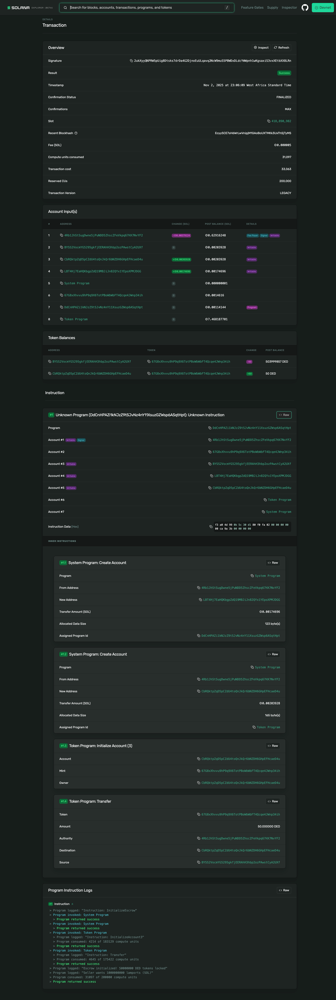

# Token Escrow Program

A secure Solana program for escrowing SPL tokens in exchange for SOL, built with the Anchor framework.

## Overview

This program enables trustless token-for-SOL exchanges on Solana. A seller (Alice) can lock tokens in an escrow and specify how much SOL they want in return. A buyer (Bob) can then complete the exchange by sending the requested SOL amount and receiving the escrowed tokens.

## Features

- **Initialize Escrow**: Lock SPL tokens and set exchange terms
- **Complete Exchange**: Atomically swap tokens for SOL
- **Cancel Escrow**: Return tokens to the initializer if deal falls through
- **Secure PDA-based Vault**: Tokens are held in a Program Derived Address (PDA) for security

## Program Architecture

### Instructions

1. **initialize_escrow**
   - Alice locks her tokens in a vault
   - Sets the amount of tokens to send and SOL to receive
   - Creates an escrow account to track the deal

2. **exchange**
   - Bob pays SOL to Alice
   - Receives Alice's tokens from the vault
   - Marks escrow as completed

3. **cancel**
   - Alice can cancel and get her tokens back
   - Closes the escrow account
   - Only works if escrow hasn't been completed

### Account Structure

```rust
pub struct EscrowAccount {
    pub initializer: Pubkey,           // Alice's wallet
    pub initializer_token_account: Pubkey,  // Alice's token account
    pub amount_to_send: u64,           // Tokens Alice is offering
    pub amount_to_receive: u64,        // SOL Alice wants (lamports)
    pub mint: Pubkey,                  // Token mint address
    pub escrow_bump: u8,               // PDA bump for escrow
    pub vault_bump: u8,                // PDA bump for vault
    pub is_completed: bool,            // Status flag
}
```

## Deployment

### Program ID
```
Devnet: DdCnHPAZi1kNJzZ9tSJvNz4nY11XsuzGZWsp6ASqtHpt
```

### Deployed Transaction
https://explorer.solana.com/address/DdCnHPAZi1kNJzZ9tSJvNz4nY11XsuzGZWsp6ASqtHpt?cluster=devnet

## Installation

### Prerequisites

- Rust 1.70+
- Solana CLI 1.18+
- Anchor 0.31.1
- Node.js 16+

### Setup

```bash
# Clone the repository
git clone <your-repo-url>
cd token-escrow

# Install dependencies
npm install

# Build the program
anchor build

# Run tests (requires local validator or devnet connection)
anchor test
```

## Usage

### Deploy to Devnet

```bash
# Configure Solana CLI for devnet
solana config set --url https://api.devnet.solana.com

# Airdrop SOL for deployment
solana airdrop 2

# Deploy the program
anchor deploy
```

### Run the Test Script

The included test script demonstrates a complete escrow flow:

```bash
# Set environment variables
export ANCHOR_PROVIDER_URL=https://api.devnet.solana.com
export ANCHOR_WALLET=~/.config/solana/id.json

# Run the test
node scripts/test-escrow.js
```

### Example Flow

1. **Alice initializes escrow**
   - Locks 50 DED tokens
   - Requests 0.01 SOL in exchange

2. **Bob completes the exchange**
   - Sends 0.01 SOL to Alice
   - Receives 50 DED tokens

3. **Result**
   - Alice has SOL
   - Bob has DED tokens
   - Escrow is marked as completed

## Development

### Project Structure

```
token-escrow/
├── programs/
│   └── token-escrow/
│       └── src/
│           └── lib.rs          # Main program logic
├── scripts/
│   └── test-escrow.js          # Integration test script
├── tests/
│   └── token-escrow.ts         # Anchor tests
├── target/
│   ├── deploy/                 # Compiled program
│   └── idl/                    # Generated IDL
├── Anchor.toml                 # Anchor configuration
└── Cargo.toml                  # Rust dependencies
```

### Building

```bash
# Clean build
anchor clean

# Build program
anchor build

# Generate IDL
anchor idl parse -f programs/token-escrow/src/lib.rs -o target/idl/token_escrow.json
```

### Testing

```bash
# Run Anchor tests (requires local validator)
anchor test

# Or run against devnet
anchor test --provider.cluster devnet
```

## Security Considerations

- **PDA Authority**: The vault is a PDA controlled by the program, ensuring tokens cannot be accessed outside program instructions
- **Completion Check**: The `is_completed` flag prevents double-spending
- **Signer Verification**: All critical operations require proper signer verification
- **Account Validation**: Constraints ensure correct account relationships

## Known Limitations

- The `cancel` instruction does not close the vault token account (minor rent inefficiency)
- Only supports direct SOL payments (not wrapped SOL/token-to-token swaps)
- Single-use escrows (one escrow per initializer at a time due to PDA seeds)

## Example Transactions

### Successful Escrow Initialization
https://explorer.solana.com/tx/2ukXyyQNPRW5pUig8Dtsks7drDa4G2DjnoEuULqavq2NcW9muS5PBWDxDLdcYWWpnh1wKgsaxiS3vxXEtbXX8LRn?cluster=devnet



## Dependencies

### Rust
- `anchor-lang = "0.31.1"`
- `anchor-spl = "0.31.1"`

### JavaScript
- `@coral-xyz/anchor = "^0.31.1"`
- `@solana/web3.js = "^1.95.8"`
- `@solana/spl-token = "^0.4.9"`
